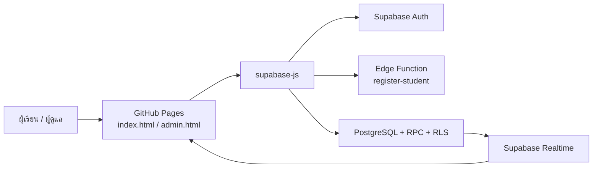

# ฟาร์มคณิต (Math Farm)

เกมฝึกคิดสำหรับนักเรียนชั้นประถมศึกษา ผู้เล่นทำภารกิจเพื่อสะสมแต้ม เข้าไปในฟาร์ม ตัดต้นไม้ ตอบโจทย์คณิตศาสตร์ รับเหรียญ และนำเหรียญไปซื้อสัตว์หรือของตกแต่งฟาร์ม ข้อมูลหลักบันทึกออนไลน์ด้วย Supabase และอัปเดตข้ามอุปกรณ์

## ลิงก์ใช้งาน

| รายการ | URL |
|---|---|
| หน้าเกม | <https://tiamobew.github.io/math-farm/index.html> |
| หน้าผู้ดูแลระบบ | <https://tiamobew.github.io/math-farm/admin.html> |
| GitHub Repository | <https://github.com/tiamobew/math-farm> |
| Supabase Project | <https://supabase.com/dashboard/project/mifxyolxisssbtqmoacm> |

## สถานะปัจจุบัน

- เปิดใช้งานผ่าน GitHub Pages จาก branch `main` และโฟลเดอร์รากของ repository
- ใช้ Supabase project ref `mifxyolxisssbtqmoacm`
- รองรับคอมพิวเตอร์ แท็บเล็ต และโทรศัพท์มือถือ
- โหมดฟาร์มบนมือถือแสดงเต็มจอ มีกล้องติดตามตัวละคร ปุ่มสัมผัสขนาดใหญ่ และเมนูแบบย่อสำหรับทั้งแนวตั้งและแนวนอน
- ใช้ฟอนต์ `Noto Sans Thai` สำหรับเนื้อหา และ `Mali` สำหรับหัวข้อกับปุ่ม
- หน้าแรกเป็นธีมท้องฟ้าและฟาร์ม สีสดใสสำหรับเด็กประถม
- มี animation เบา ๆ เช่น หุ่นยนต์ลอย กะพริบตา โบกมือ เด้งดีใจ เมฆเคลื่อน ดาวกระพริบ และไอคอนขยับ
- สัตว์เลี้ยงมี JavaScript animation แบบนุ่มนวล เช่น เด้งตามจังหวะเดิน ยืดหดเล็กน้อย แสดงหัวใจหรือประกาย และมีฟองอากาศลอยในบ่อปลา
- มีมุมมองฟาร์ม Three.js แบบ 3D low-poly พร้อมปุ่มสลับกลับ 2D โดยใช้สถานะผู้เล่น ต้นไม้ สัตว์ บ้าน รั้ว ของตกแต่ง และบ่อน้ำชุดเดียวกัน หาก WebGL 2 ไม่พร้อมหรือผู้เล่นเปิดโหมดลดการเคลื่อนไหว ระบบจะใช้ 2D อัตโนมัติ
- ฉากฟาร์มมีภูเขาซ้อนชั้น แสงอาทิตย์ เมฆมีเงา ทางเดิน บ่อน้ำมีระลอก ดอกไม้ ดอกบัว และผีเสื้อเคลื่อนไหว
- บ่อน้ำเป็นทรงสี่เหลี่ยมมุมมนอยู่ด้านล่างสุดของที่ดิน และกระเป๋าสัตว์เลี้ยงแสดงเป็นชั้นด้านหลังลำตัวเหมือนสะพายอยู่บนหลัง
- ฟาร์มแบ่งเป็นโซนตัดไม้ทางซ้ายและที่ดินผู้เล่นทางขวา บ้าน สัตว์ และของตกแต่งอยู่ฝั่งเดียวกัน โดยชิ้นรั้วมีการชนและกั้นสัตว์ไม่ให้เดินผ่าน
- ปิด animation อัตโนมัติเมื่ออุปกรณ์ตั้งค่า `prefers-reduced-motion`
- บัญชีสมาชิกใหม่ไม่ต้องกดยืนยันอีเมล เพราะ Edge Function สร้างบัญชีพร้อม `email_confirm: true`

## ความสามารถของผู้เรียน

### บัญชีและโปรไฟล์

- สมัครสมาชิกด้วยชื่อ ชั้น/ห้อง เลขที่ อีเมล Username รหัสผ่าน และรหัสสมัครจากครู
- เข้าสู่ระบบด้วยอีเมลและรหัสผ่านผ่าน Supabase Auth
- ปรับสีและชื่อหุ่นยนต์ประจำตัว พร้อมตัวอย่างชื่อแบบเรียลไทม์ ปุ่มสุ่มชื่อ และข้อความตอบสนองจากตัวละคร
- บันทึกโปรไฟล์ คะแนน เหรียญ สัตว์ ของตกแต่ง และสถานะฟาร์มออนไลน์

### ภารกิจการเรียน

- แสดงภารกิจที่ผู้ดูแลเปิดใช้งาน
- ทำภารกิจแต่ละข้อได้วันละ 1 ครั้ง โดยนับวันตามเขตเวลา `Asia/Bangkok`
- ต้องแนบภาพหลักฐานก่อนรับแต้ม
- แสดงเลเวล ความก้าวหน้า เหรียญรางวัล จำนวนภารกิจ และจำนวนวันที่ทำกิจกรรม
- มีอันดับผู้เรียนตามแต้มสะสม

### เกมฟาร์ม

- ฟาร์มเต็มหน้าจอวาดด้วย HTML Canvas ในมุมมองแบบมีมิติ
- เดินด้วยปุ่มลูกศร, `WASD`, ปุ่มควบคุมบนจอสัมผัส หรือแตะตำแหน่งที่ต้องการเดินไป
- เข้าใกล้ต้นไม้แล้วกด Space/ปุ่มตัด หรือแตะต้นไม้
- ต้องตอบโจทย์ให้ถูกก่อนจึงตัดต้นไม้และรับเหรียญ
- โจทย์ถูกสุ่มแบบไม่ซ้ำจนกว่าจะใช้ครบคลัง และบันทึกรอบการสุ่มไว้เมื่อรีโหลดหรือเล่นต่อ
- ตอบถูกแล้วได้รับทั้งคะแนนตามที่ครูกำหนดต่อข้อและเหรียญรางวัล
- เลือกกรองโจทย์ตามวิชาได้
- ต้นไม้เกิดใหม่หลังจากถูกตัด
- ซื้อสัตว์และของตกแต่งจากร้านค้าด้วยเหรียญ มีไก่ เป็ด ปลา หมู วัว และสุนัขปั๊กในสไตล์การ์ตูนสีสด
- ซื้ออาหารสัตว์แล้วแตะสัตว์ตัวที่ต้องการ เพื่อใส่หรือเปลี่ยนหมวก โบว์ กระเป๋า หรือสีเฉพาะตัวนั้น โดยไอคอนอุปกรณ์บนสัตว์ใช้สีและรูปแบบเดียวกับตัวอย่างในร้านค้า
- เครื่องแต่งตัวและจำนวนอาหารบันทึกออนไลน์ แยกตามสัตว์แต่ละตัวแม้เป็นชนิดเดียวกัน
- บันทึกตำแหน่งผู้เล่น ต้นไม้ และวิชาที่เลือก เพื่อเล่นต่อบนอุปกรณ์อื่น
- มีเสียงประกอบและปุ่มเปิด/ปิดเสียง

## ความสามารถของผู้ดูแลระบบ

หน้า `admin.html` ใช้ Supabase Auth และตรวจบทบาท `admin` จากฐานข้อมูล ไม่ได้ใช้ PIN ที่ฝังในหน้าเว็บ

หน้า Admin รองรับมือถือด้วยแถบเมนูเลื่อนแนวนอน การ์ดผู้เรียน/อันดับ/ราคา และหน้าต่างแก้ไขที่พอดีกับจอสัมผัส

บัญชีอีเมล `tiamobew@gmail.com` จะได้รับบทบาท `admin` อัตโนมัติจาก migration เมื่อสร้างบัญชี ห้ามบันทึกรหัสผ่านของผู้ดูแลไว้ใน repository หรือ README

เมนูผู้ดูแลประกอบด้วย:

- **ผู้เรียน** — เพิ่มบัญชีนักเรียน ดูรายชื่อ แก้ไขชื่อ ชั้น เลขที่ แต้ม และเหรียญ หรือลบผู้เรียน
- **สถิติ/อันดับ** — ดูอันดับตามแต้มและจำนวนครั้งที่ภารกิจถูกทำสำเร็จ
- **จัดการภารกิจ** — เพิ่ม แก้ไข ปิดใช้งาน และกำหนดแต้มภารกิจ
- **คลังข้อสอบ** — แสดงข้อสอบทั้งหมด ค้นหา/กรองตามวิชา เพิ่ม แก้ไข ปิดใช้งาน และกำหนดคะแนนกับเหรียญต่อข้อ
- **นำเข้าโจทย์** — วางข้อมูลหลายข้อพร้อมกัน หรือนำเข้า/ส่งออก CSV ที่มีคอลัมน์โจทย์ คำตอบ คะแนน เหรียญ และวิชา
- **ราคาร้านค้า** — แก้ไขราคาสัตว์และของตกแต่ง
- **หลักฐานกิจกรรม** — ค้นหาและตรวจหลักฐานภารกิจ
- **ส่งออกข้อมูล** — ดาวน์โหลดรายชื่อผู้เรียนและประวัติภารกิจเป็น CSV สำหรับเปิดใน Excel

การเปลี่ยนรหัสผ่านของผู้เรียนในโหมด Supabase ให้ทำจาก **Supabase Dashboard → Authentication → Users**

## สถาปัตยกรรม



โปรเจกต์เป็นเว็บสแตติก HTML/CSS/JavaScript ไม่ต้องมีเซิร์ฟเวอร์แอปพลิเคชันแยก หน้าเว็บเรียก Supabase โดยตรงด้วย Publishable key และใช้ Row Level Security (RLS) ควบคุมสิทธิ์

ลำดับการเลือกแหล่งข้อมูลในหน้าเว็บ:

1. Supabase เมื่อ `supabase-config.js` มี URL และ Publishable key
2. Google Apps Script เมื่อกำหนด `CONFIG.GAS_URL` (โหมดเดิมที่ยังเหลือไว้เพื่อความเข้ากันได้)
3. `localStorage` เมื่อยังไม่เชื่อมระบบออนไลน์

โหมดที่ใช้งานจริงในปัจจุบันคือ **Supabase**

## ข้อมูลที่เก็บใน Supabase

| ตาราง | ข้อมูล |
|---|---|
| `profiles` | โปรไฟล์ บทบาท แต้ม เหรียญ ตัวละคร สัตว์ อาหาร เครื่องแต่งตัวรายตัว ของตกแต่ง และสถานะฟาร์ม |
| `missions` | รายการภารกิจ ไอคอน แต้ม ลำดับ และสถานะเปิดใช้งาน |
| `questions` | คำถาม คำตอบ วิชา คะแนน เหรียญ ลำดับ และสถานะเปิดใช้งาน |
| `shop_items` | สัตว์ อาหารสัตว์ ของตกแต่ง ราคา และสถานะเปิดใช้งาน |
| `mission_completions` | ประวัติภารกิจ แต้ม วันที่ เวลา และหลักฐาน |
| `question_attempts` | คำตอบที่ส่ง ผลถูก/ผิด คะแนนและเหรียญที่ได้รับ และเวลา |

การตั้งค่าภายใน เช่น รหัสสมัครจากครู เก็บใน `private.app_settings` ซึ่งไม่เปิดให้ `anon` หรือ `authenticated` อ่านโดยตรง

หลักฐานภารกิจปัจจุบันเก็บเป็น Data URL ใน `mission_completions.evidence_data_url` และฟังก์ชันฐานข้อมูลจำกัดขนาดข้อความไว้ไม่เกิน 1,000,000 ตัวอักษร

### Realtime

ตารางต่อไปนี้ถูกเพิ่มใน publication `supabase_realtime`:

- `profiles`
- `missions`
- `questions`
- `shop_items`

เมื่อผู้ดูแลแก้ภารกิจ โจทย์ ราคา หรือข้อมูลผู้เล่น หน้าเว็บที่เปิดอยู่จะรับ event และโหลดข้อมูลใหม่ ทำให้การเปลี่ยนแปลงแสดงในอุปกรณ์อื่นโดยไม่ต้อง deploy หน้าเว็บใหม่

### RPC ที่ใช้ในเกม

| ฟังก์ชัน | หน้าที่ |
|---|---|
| `get_my_profile()` | โหลดโปรไฟล์ของผู้ใช้ที่ล็อกอิน |
| `save_character(text,text)` | บันทึกสีและชื่อตัวละคร |
| `get_mission_dashboard()` | โหลดภารกิจและสถิติของวันนี้ |
| `get_leaderboard()` | โหลดอันดับผู้เรียนโดยปกปิดข้อมูลส่วนตัวของผู้อื่น |
| `get_farm()` | โหลดเหรียญ สัตว์ ของตกแต่ง ร้านค้า และสถานะฟาร์ม |
| `save_farm_state(jsonb)` | บันทึกสถานะฟาร์ม |
| `list_question_prompts()` | ส่งเฉพาะคำถามไปยังผู้เล่น โดยไม่ส่งเฉลย |
| `submit_answer(text,text)` | ตรวจคำตอบและเพิ่มคะแนนกับเหรียญจากฝั่งฐานข้อมูล |
| `purchase_item(text,text)` | ตรวจราคา หักเหรียญ และเพิ่มสัตว์ อาหาร หรือของตกแต่งแบบ atomic |
| `feed_pet(text,text)` | ตรวจสัตว์เจ้าของ หักอาหาร 1 ชิ้น และบันทึกเครื่องแต่งตัวเฉพาะตัว |
| `complete_mission(text,text)` | บันทึกภารกิจและเพิ่มแต้ม โดยกันการทำซ้ำในวันเดียวกัน |
| `admin_delete_user(text)` | ลบบัญชีผู้เรียนโดยผู้ดูแล |

## โครงสร้างไฟล์

```text
math-farm/
├── index.html                         # หน้าเกมและ Canvas ฟาร์ม
├── admin.html                         # หน้าผู้ดูแลระบบ
├── supabase-config.js                 # Supabase URL และ Publishable key
├── supabase-api.js                    # ชั้นเชื่อม Auth, Database, RPC และ Realtime
├── package.json                       # คำสั่ง Supabase CLI
├── package-lock.json                  # ล็อกเวอร์ชัน dependency
├── supabase/
│   ├── config.toml                    # การตั้งค่า Supabase project
│   ├── functions/
│   │   └── register-student/index.ts  # สมัครสมาชิกและยืนยันอีเมลอัตโนมัติ
│   └── migrations/
│       ├── 20260809150000_math_farm_online.sql
│       └── 20260809160000_tune_policies.sql
└── README.md
```

## เริ่มพัฒนาในเครื่อง

### สิ่งที่ต้องมี

- Git
- Node.js และ npm
- Python (ใช้เปิด static server ได้สะดวก)
- บัญชี Supabase ที่เข้าถึง project ได้

ติดตั้ง dependency:

```bash
npm install
```

ตรวจเวอร์ชัน Supabase CLI ที่ล็อกไว้ในโปรเจกต์:

```bash
npm run supabase -- --version
```

เปิดเว็บในเครื่องจากโฟลเดอร์โปรเจกต์:

```bash
python -m http.server 8000
```

จากนั้นเปิด:

- <http://127.0.0.1:8000/index.html>
- <http://127.0.0.1:8000/admin.html>

ควรเปิดผ่าน HTTP server ไม่ควรดับเบิลคลิกเปิดเป็น `file://` เพราะ Auth, module/CDN และคำขอเครือข่ายบางส่วนอาจทำงานไม่ถูกต้อง

## ตั้งค่า Supabase

### 1. เข้าสู่ระบบและเชื่อม project

```bash
npm run supabase -- login
npm run supabase -- link --project-ref mifxyolxisssbtqmoacm
```

### 2. ลง schema และข้อมูลเริ่มต้น

```bash
npm run supabase -- db push
```

คำสั่งนี้จะลง migration ใน `supabase/migrations/` ซึ่งสร้างตาราง RLS policy, trigger, RPC, ภารกิจเริ่มต้น โจทย์เริ่มต้น และสินค้าเริ่มต้น

### 3. Deploy Edge Function สมัครสมาชิก

```bash
npm run supabase -- functions deploy register-student --no-verify-jwt
```

Edge Function ใช้ secret key จาก environment ฝั่ง Supabase เพื่อเรียก Admin API ห้ามนำ secret key หรือ `service_role` มาใส่ในไฟล์หน้าเว็บ

### 4. ตั้งค่า Publishable key

แก้ไฟล์ `supabase-config.js`:

```js
window.MATH_FARM_SUPABASE = Object.freeze({
  url: "https://mifxyolxisssbtqmoacm.supabase.co",
  publishableKey: "YOUR_PUBLISHABLE_KEY"
});
```

Publishable key ถูกออกแบบให้ใช้งานใน browser ได้ แต่สิทธิ์จริงต้องถูกจำกัดด้วย RLS ห้ามใช้ Secret key หรือ `service_role` ในไฟล์นี้

### 5. เปลี่ยนรหัสสมัครจากครู

ค่าเริ่มต้นจาก migration คือ `1234` ควรเปลี่ยนก่อนใช้งานจริง โดยรันใน Supabase SQL Editor ด้วยค่าที่ต้องการ:

```sql
update private.app_settings
set value = 'รหัสใหม่', updated_at = now()
where key = 'registration_code';
```

อย่าบันทึกรหัสใช้งานจริงลงใน repository สาธารณะ

## ระบบสมาชิกและอีเมลยืนยัน

- `supabase/config.toml` ตั้ง `enable_confirmations = false`
- Edge Function `register-student` สร้างผู้ใช้ด้วย `email_confirm: true`
- ผู้ดูแลเพิ่มนักเรียนจากหน้าแอดมินได้โดยไม่ต้องกรอกรหัสสมัครจากครู แต่ Edge Function จะตรวจ JWT และบทบาท `admin` ก่อนทุกครั้ง
- Trigger `private.handle_new_auth_user()` สร้างแถวใน `profiles`
- นักเรียนต้องกรอกรหัสสมัครจากครูให้ถูกต้อง
- อีเมล `tiamobew@gmail.com` ได้บทบาท `admin`; อีเมลอื่นได้บทบาท `student`
- Username ถูกบังคับไม่ให้ซ้ำแบบไม่สนตัวพิมพ์เล็ก/ใหญ่
- รหัสผ่านนักเรียนต้องยาวอย่างน้อย 8 ตัวอักษร

## ความปลอดภัย

- เปิด RLS ทุกตารางใน schema `public`
- ปิดสิทธิ์ `anon` สำหรับข้อมูลเกม
- ผู้เรียนอ่านข้อมูลของตนเองและเขียนผ่าน RPC ที่กำหนดเท่านั้น
- ผู้ดูแลถูกตรวจด้วย `private.is_admin()` และบทบาทใน `profiles`
- เฉลยโจทย์ไม่ถูกส่งไปยัง browser; ตรวจคำตอบใน PostgreSQL
- การเพิ่มแต้ม เหรียญ ซื้อสินค้า และทำภารกิจอยู่ในฟังก์ชันฐานข้อมูล
- ฟังก์ชันที่ใช้ `SECURITY DEFINER` ถูก revoke จาก `public`/`anon` และ grant เฉพาะ `authenticated`
- ห้าม commit รหัสผ่าน, access token, Secret key หรือ `service_role`
- Publishable key เปิดเผยได้ตามการออกแบบ แต่ไม่สามารถทดแทน RLS ได้

## Deploy ไป GitHub Pages

Repository นี้ตั้ง GitHub Pages ให้ deploy จาก branch `main` และโฟลเดอร์ `/ (root)` แล้ว

ขั้นตอนเผยแพร่การแก้ไข:

```bash
git add <ไฟล์ที่แก้>
git commit -m "คำอธิบายการเปลี่ยนแปลง"
git push origin main
```

หลัง push ให้ตรวจ workflow **pages build and deployment** ที่หน้า GitHub Actions โดยทั่วไปใช้เวลาประมาณ 1–3 นาที หน้าเว็บไม่ต้อง build เพราะเป็นไฟล์สแตติก

## ตรวจสอบก่อนเผยแพร่

- เปิด `index.html` และ `admin.html` ผ่าน local HTTP server
- ทดสอบหน้าเข้าสู่ระบบและสลับไปหน้าสมัครสมาชิก
- ทดสอบขนาดจอคอมพิวเตอร์และมือถือ และตรวจว่าไม่มี horizontal overflow
- ล็อกอินผู้เรียน ทดสอบภารกิจ ฟาร์ม ตอบโจทย์ ซื้อสินค้า และบันทึกฟาร์ม
- ล็อกอินผู้ดูแล ทดสอบเพิ่ม/แก้ไขโจทย์และตรวจว่าอุปกรณ์อื่นอัปเดตผ่าน Realtime
- ตรวจ Console ว่าไม่มี JavaScript error
- ตรวจ diff ก่อน commit:

```bash
git diff --check
git status -sb
```

## แก้ปัญหาเบื้องต้น

### ข้อมูลไม่ข้ามอุปกรณ์

1. ตรวจว่า `supabase-config.js` มี URL และ Publishable key ที่ถูกต้อง
2. ตรวจป้ายสถานะบนหน้าเว็บว่าขึ้น `Supabase · บันทึกออนไลน์ทุกอุปกรณ์`
3. ตรวจว่า migration ถูกลงครบด้วย `npm run supabase -- migration list`
4. ตรวจว่า `profiles`, `missions`, `questions` และ `shop_items` อยู่ใน Realtime publication
5. ตรวจ RLS policy และ session ของผู้ใช้

### สมัครสมาชิกไม่ได้

1. ตรวจว่า Edge Function `register-student` deploy แล้ว
2. ตรวจ log ของ Edge Function ใน Supabase Dashboard
3. ตรวจรหัสสมัครจากครูใน `private.app_settings`
4. ตรวจว่าอีเมลยังไม่ถูกใช้ และรหัสผ่านยาวอย่างน้อย 8 ตัวอักษร

### เข้าหน้าแอดมินไม่ได้

1. ตรวจว่าล็อกอินด้วยอีเมลผู้ดูแล
2. ตรวจ `profiles.role` ว่าเป็น `admin`
3. อย่าใส่ PIN เดิม เพราะโหมด Supabase ใช้อีเมลและรหัสผ่าน

### เว็บยังเป็นหน้ารุ่นเก่า

1. ตรวจว่า commit อยู่บน branch `main`
2. ตรวจ GitHub Actions ว่า Pages deployment สำเร็จ
3. รีเฟรชแบบไม่ใช้ cache หรือรอสักครู่ให้ CDN อัปเดต

## หมายเหตุ

- ข้อมูลใน `localStorage` เป็นเพียง fallback และไม่ซิงก์ข้ามอุปกรณ์
- การแก้โจทย์ ภารกิจ และราคาผ่านหน้าแอดมินในโหมด Supabase บันทึกออนไลน์ทันที ไม่ต้องแก้ไฟล์ HTML และไม่ต้อง deploy GitHub Pages ใหม่
- โค้ดเกมปัจจุบันเป็น Vanilla JavaScript และ Canvas ยังไม่ได้ย้ายเป็น React
- ภาพฟาร์มให้ความรู้สึกมีมิติ แต่ยังไม่ใช่เกม 3D ที่ใช้ WebGL/Three.js
